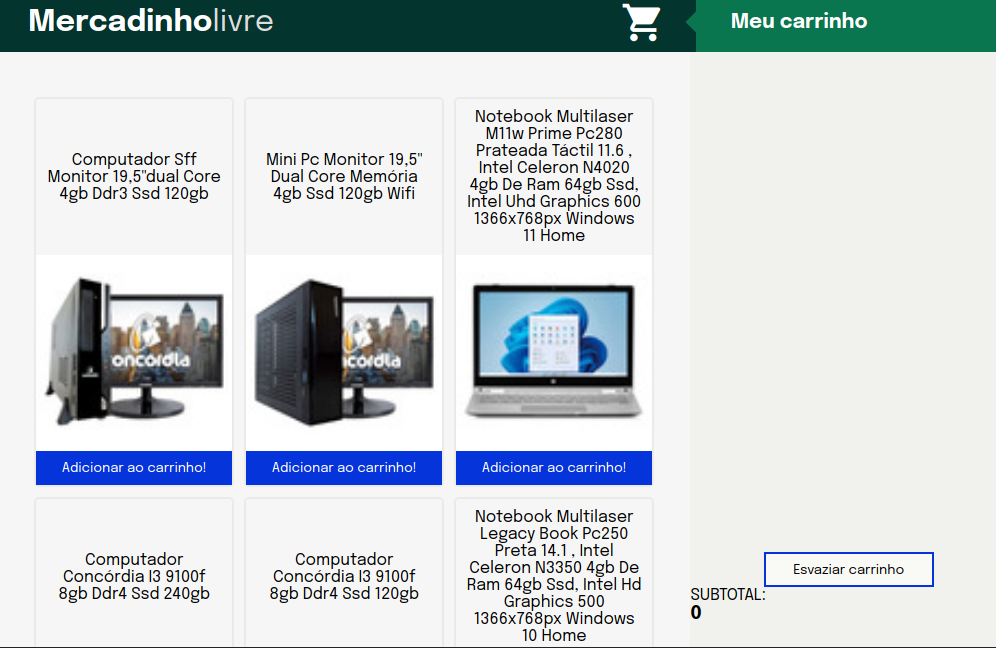

# Boas vindas ao repositório do projeto Mercadinho-livre!

Esse projeto é um projeto que usei para aprendizado javascript no curso de desenvolvdor web na Trybe.

Esta aplicação se trata de um site com um carrinho de compras totalmente dinâmico! os produtos são de uma API(Application Programming Interface) do mercado livre. Através de requisições HTTP a essa API é possível interagir com ela da forma como quem a criou planejou. Aqui usaremos a API do Mercado Livre para buscarmos produtos à venda.

# ‼️ instalando este projeto !!

  1. Clone o repositório
  - Entre na pasta que deseja instalar e abra o terminal.
  - Use o comando: `git clone git@github.com:th-maia/mercadinho-livre.git`.
  - Entre na pasta do repositório que você acabou de clonar:
    - comando via terminal `cd mercadinho-livre`

  2. para rodar a plicação execute o arquivo `index.html`.

  3. Para rodar os testes que tive que passar durante o curso da trybe instale as dependencias:
  - Para isso, use o seguinte comando: `npm install`, espere alguns segundos.
      caso dê algum erro tente rodar novamente o comando acima, pode ocorrer por diferentes versões ou pacotes que foram instalados após outros.
  3. Para rodar os testes `npm run cypress:open`, abrirá uma janela clique no nome do arquivo e eles vai rodar os testes.
